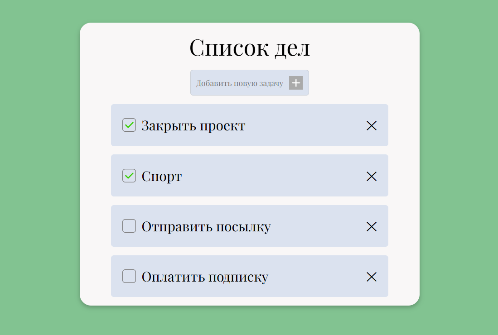

# ToDo App

Простой и стильный сайт со списком дел. Создан на JavaScript, HTML и CSS, с сохранением данных в браузере.

**Сайт** [siazur.github.io/todo-list](https://siazur.github.io/todo-list/)



## Возможности

- добавление новых задач
- отметка выполненных задач
- удаление задач
- сохранение в localStorage
- адаптивный дизайн

## Технологии 

- HTML5 структура
- CSS3 стили и адаптивность
- JavaScript логика, работа с DOM, localStorage, обработка событий

## Использование

1. **Добавление задачи** 
    - Введите текст задачи в поле "Добавить новую задачу"
    - Нажмите Enter или кнопку с плюсом

2. **Выполнение задачи**
    - Нажмите на пустое окошко слева от задачи для появления галочки
    - Галочку можно убрать нажатием по ней

3. **Удаление задачи**
    - Нажмите на крестик

## Структура проекта

```
todo-list/
    - index.html
    - css/
        - main.css
        - reset.css
    - js/
        - main.js
    - img/
        - add_plus.svg
        - boundary_line.png
        - check.svg
    - screenshots/
        - todo.png
    - README.md
```

## Лицензия 

MIT © [siazur](https://github.com/siazur)

## Автор

- GitHub [@siazur](https://github.com/siazur)